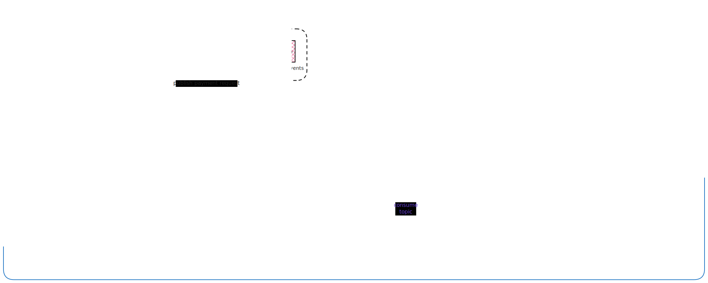
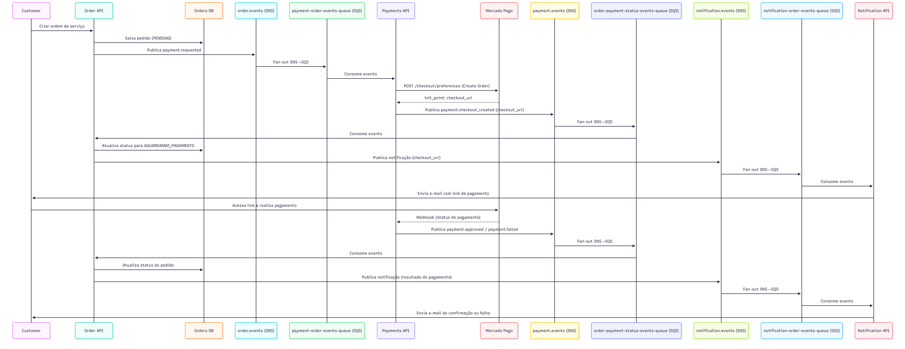

# Payments API

Microsserviço Go responsável pelo processamento de pagamentos em um sistema de oficina mecânica. Opera como participante da **SAGA Coreografada**, consumindo eventos de pedidos via AWS SQS, integrando com o **Mercado Pago Checkout Pro** para geração de links de pagamento e publicando eventos de resultado via **AWS SNS**.

## Visão Geral

```
OrderAPI
   │  SNS: order.events
   │  └─► SQS: order-events-queue
   │            │
   │            ▼
   │      PaymentsAPI  ◄──── POST /webhooks/mercadopago ◄──── Mercado Pago
   │            │
   │            │  SNS: payment.events
   │            ├─► PaymentCheckoutCreated → NotificationAPI (envia link ao cliente)
   │            ├─► PaymentApproved        → OrderAPI + NotificationAPI
   │            └─► PaymentFailed          → OrderAPI + NotificationAPI
```

## Fluxo de Pagamento



1. `OrderAPI` publica `OrderCreated` no SNS `order.events`
2. `PaymentsAPI` consome via SQS (com unwrap do envelope SNS)
3. Cria preferência de pagamento no Mercado Pago (Checkout Pro)
4. Persiste o pagamento com status `PENDING_CUSTOMER_ACTION` / `SagaStatus: AWAITING_PAYMENT`
5. Publica `PaymentCheckoutCreated` com o `checkout_url` para `NotificationAPI`
6. Mercado Pago notifica o status via webhook `POST /webhooks/mercadopago`
7. Webhook é validado via assinatura HMAC (`x-signature`) e processado idempotentemente
8. Publica `PaymentApproved` ou `PaymentFailed` no SNS `payment.events`



## Arquitetura

Projeto organizado seguindo **Clean/Hexagonal Architecture**:

```
cmd/
└── api/
    └── main.go                        # Entrypoint, wiring de dependências, graceful shutdown

internal/
├── core/
│   ├── domain/
│   │   └── payment.go                 # Entidade Payment, BusinessStatus, SagaStatus, PaymentStatus
│   ├── ports/
│   │   ├── message_broker.go          # Interface MessageBroker (SNS)
│   │   ├── payment_gateway.go         # Interface PaymentGateway (Mercado Pago)
│   │   └── payment_repository.go      # Interface PaymentRepository
│   └── services/
│       └── payment_service.go         # Casos de uso: ProcessPaymentRequest, ProcessWebhook
└── adapters/
    ├── in/
    │   ├── http/
    │   │   └── webhook_handler.go     # POST /webhooks/mercadopago
    │   └── sqs/
    │       └── consumer.go            # Consumer SQS com unwrap de envelope SNS
    └── out/
        ├── database/
        │   └── sqlite_repository.go   # Repositório SQLite (PostgreSQL em produção via DATABASE_URL)
        ├── mercadopago/
        │   └── client.go              # Cliente HTTP nativo para Preferences API e Payment API
        └── sns/
            └── publisher.go           # Publisher SNS para payment.events
```

## Eventos

### Consumidos

| Evento | Fila SQS | Origem |
|--------|----------|--------|
| `OrderCreated` | `SQS_QUEUE_URL_ORDER_EVENTS` (inscrita no SNS `order.events`) | OrderAPI |

### Publicados

| Evento | Tópico SNS | Destino |
|--------|-----------|---------|
| `PaymentCheckoutCreated` | `SNS_TOPIC_ARN_PAYMENT` | NotificationAPI |
| `PaymentApproved` | `SNS_TOPIC_ARN_PAYMENT` | OrderAPI, NotificationAPI |
| `PaymentFailed` | `SNS_TOPIC_ARN_PAYMENT` | OrderAPI, NotificationAPI |

## Endpoint HTTP

### `POST /webhooks/mercadopago`

Recebe notificações de status de pagamento do Mercado Pago.

**Headers obrigatórios:**

| Header | Descrição |
|--------|-----------|
| `x-signature` | Assinatura HMAC-SHA256 gerada pelo MP (`ts=...;v1=...`) |
| `x-request-id` | ID da requisição gerado pelo MP, usado no manifesto de validação |

**Payload:**

```json
{
  "type": "payment",
  "data": {
    "id": "<payment_id>"
  }
}
```

**Comportamento:**
- Retorna `HTTP 200` imediatamente; processamento ocorre em goroutine para atender ao SLA de < 500ms do Mercado Pago
- Requisições sem `x-signature` ou com assinatura inválida retornam `HTTP 400`
- Idempotente: webhooks para pagamentos já em estado final (`APPROVED`/`FAILED`) são ignorados

## Variáveis de Ambiente

| Variável | Obrigatória | Padrão | Descrição |
|----------|-------------|--------|-----------|
| `MERCADOPAGO_ACCESS_TOKEN` | Sim | — | Token de acesso da conta Mercado Pago |
| `MERCADOPAGO_PUBLIC_KEY` | Sim | — | Chave pública do Mercado Pago |
| `MERCADOPAGO_WEBHOOK_SECRET` | Sim | — | Secret para validação HMAC dos webhooks |
| `SQS_QUEUE_URL_ORDER_EVENTS` | Sim | — | URL da fila SQS de eventos de pedidos |
| `SNS_TOPIC_ARN_PAYMENT` | Sim | — | ARN do tópico SNS de eventos de pagamento |
| `DATABASE_URL` | Não | `payments.db` | DSN do banco. SQLite por padrão; PostgreSQL em produção |
| `AWS_REGION` | Não | `us-east-1` | Região AWS |
| `PORT` | Não | `8080` | Porta do servidor HTTP |
| `WEBHOOK_BASE_URL` | Não | — | URL base pública do serviço (usada na `notification_url` enviada ao MP) |
| `BACK_URL_SUCCESS` | Não | — | URL de redirecionamento após pagamento aprovado |
| `BACK_URL_FAILURE` | Não | — | URL de redirecionamento após pagamento recusado |
| `BACK_URL_PENDING` | Não | — | URL de redirecionamento para pagamento pendente |

## Rodando Localmente

### Pré-requisitos

- Go 1.24+
- GCC (necessário para `go-sqlite3`)
- [AWS CLI](https://aws.amazon.com/cli/) configurado (ou LocalStack para desenvolvimento local)
- Conta Mercado Pago (sandbox disponível em [developers.mercadopago.com](https://developers.mercadopago.com))
- [ngrok](https://ngrok.com/) ou similar para expor o webhook publicamente

### Configuração

```bash
cp .env.example .env
# Preencha as variáveis no .env
```

Exemplo de `.env`:

```env
MERCADOPAGO_ACCESS_TOKEN=TEST-xxxx
MERCADOPAGO_PUBLIC_KEY=TEST-xxxx
MERCADOPAGO_WEBHOOK_SECRET=seu_secret_aqui

SQS_QUEUE_URL_ORDER_EVENTS=https://sqs.us-east-1.amazonaws.com/000000000000/order-events-queue
SNS_TOPIC_ARN_PAYMENT=arn:aws:sns:us-east-1:000000000000:payment-events

WEBHOOK_BASE_URL=https://seu-ngrok.ngrok.io
DATABASE_URL=payments.db
```

### Executar

```bash
go run ./cmd/api
```

### Testes

```bash
go test ./...
```

## Infraestrutura AWS

Filas e tópicos necessários:

| Recurso | Tipo | Descrição |
|---------|------|-----------|
| `order-events-queue` | SQS | Inscrita no tópico SNS `order.events` da OrderAPI |
| `order-events-queue-dlq` | SQS | DLQ para mensagens que excedem retries |
| `payment-events` | SNS | Tópico de saída dos eventos de pagamento |

> Recomendado configurar DLQ em todas as filas com política de redrive após 3 tentativas.

## Modelo de Dados

O domínio `Payment` separa estado de negócio de estado de orquestração:

| Campo | Tipo | Descrição |
|-------|------|-----------|
| `BusinessStatus` | `PENDING / APPROVED / FAILED` | Status externo publicado nos eventos SAGA |
| `SagaStatus` | `STARTED / AWAITING_PAYMENT / PAYMENT_CONFIRMED / FAILED` | Estado interno de orquestração |
| `Status` | `PENDING_CUSTOMER_ACTION / APPROVED / FAILED / CANCELLED / PENDING` | Status bruto retornado pelo Mercado Pago |
| `TransactionAmount` | `float64` | Valor cobrado do cliente |
| `NetAmount` | `float64` | Valor líquido recebido (após taxas do MP) |
| `CorrelationID` | `string` | ID de correlação da SAGA distribuída |
| `Provider` | `string` | Gateway de pagamento (`MERCADO_PAGO`) |

## Decisões de Design

- **`net/http` nativo** em vez do SDK oficial do Mercado Pago — controle total sobre timeouts e retry, sem dependência extra para dois endpoints simples
- **SQLite em desenvolvimento, PostgreSQL em produção** — mesma interface `database/sql`; troca via `DATABASE_URL` sem alterar lógica
- **Idempotência por estado final** — antes de processar webhook, verifica `BusinessStatus`; se já em estado final, retorna 200 sem reprocessar
- **Resposta imediata no webhook** — `HTTP 200` retornado antes do processamento (goroutine em background) para atender ao SLA de 500ms do Mercado Pago
- **Graceful shutdown** — captura `SIGINT`/`SIGTERM`; aguarda até 10s para o servidor HTTP finalizar requisições em andamento
